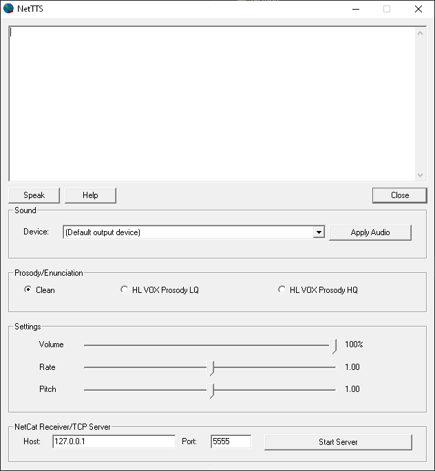

# NetTTS

<p align="center">
  
</p>

<p align="center">
  
</p>

NetTTS keeps vintage-friendly speech synthesis fun instead of fiddly. It wraps FlexTalk and other SAPI 4.0 voices in a warm GUI that feels equally at home on a Pentium III, modern Windows 10 x64, or a Wine 8+ sandbox running on your favorite Linux box.

## Highlights

- **Retro hardware ready** – Ship one lightweight executable that behaves on classic Windows installs without a DLL scavenger hunt.
- **Pure cross-compiled build** – Build everything from Linux with MinGW-w64; no need to chase abandoned Microsoft downloads.
- **Bundled speech headers** – A known-good `speech.h` is vendored under `third_party/include/` so the toolchain never breaks.
- **Wine-tested workflow** – Mirrors the maintainer's Devuan + Wine environment, making it painless to automate or integrate.

## Run the prebuilt binary

1. Download the zipped executable from the [Releases](../../releases) page and unpack it somewhere handy.
2. Install the Microsoft SAPI 4.0 runtime (`third_party/Dependencies/spchapi.exe` lives in the repo for safekeeping) if your machine doesn't already have it.
3. Add the FlexTalk voice by extracting `third_party/Dependencies/flextalk.zip` and running the installer. FlexTalk traces its lineage through AT&T, Bell Laboratories, and the successors who have shepherded it since, and the credit belongs with them.
4. Launch `nettts_gui.exe` on Windows or via Wine — for example `wrun ./build/nettts_gui.exe` in the maintainer's setup.

Want to coax a little melody out of it? The [NetTTS sing-along gist](https://gist.github.com/h4rm0n1c/2ddaa14c03be25c2072347a1b27e25da) has a ready-made script to rick roll.

## Wine prefix automation

Need a ready-to-roll Wine XP sandbox with SAPI 4.0, FlexTalk, and NetTTS preinstalled? Run the helper script:

```bash
./scripts/winetricks/setup_nettts_prefix.sh
```

The script leans on winetricks to apply `winxp`, `vcrun6`, and `mfc42`, downloads the SAPI runtime, FlexTalk voice archive, and
the `v0.95c` NetTTS release zip (override with `--sapi-url`, `--flextalk-url`, or `--nettts-url` if you need a different build) into `C:\nettts`, and drops a Start Menu shortcut under `C:\\Users\\Public\\Start Menu\\Programs`. See
[docs/winetricks.md](docs/winetricks.md) for prerequisites and additional options.

## Quick start build (Linux host)

```bash
sudo apt-get update
sudo apt-get install -y make mingw-w64 g++-mingw-w64-i686

make -f Makefile.mingw -j"$(nproc)"
# → build/nettts_gui.exe
```

The resulting binary lands in `./build/` and can be launched on Windows or via Wine (`$HOME/bin/wrun ./build/nettts_gui.exe`).

## Customize the include path

By default the build pulls in the bundled header at `third_party/include/speech.h`. If you have a different SDK you want to test against, point `INC_DIR` wherever you need:

```bash
make -f Makefile.mingw INC_DIR="C:/Program Files/Microsoft Speech SDK/Include" -j"$(nproc)"
```

## Housekeeping

- **Clean builds:** `make -f Makefile.mingw clean`
- **Artifacts:** Everything lands in `./build/`
- **Optional extras:** If the `Dependencies/` folder is present, it may carry installers for the SAPI 4 SDK, runtime, or FlexTalk voice. They're handy for setting up Windows, but thanks to the in-repo header the build stays fully reproducible.


Thanks to valve software as well for making some fucking incredible games.

This application is a love letter to the Win32 application style of the 90s and 2000s that defined the early tech experiences of so many IT nerds like me.

Developed with the assistance and insight of ChatGPT and then ChatGPT Codex once it grew beyond a single main.cpp.
